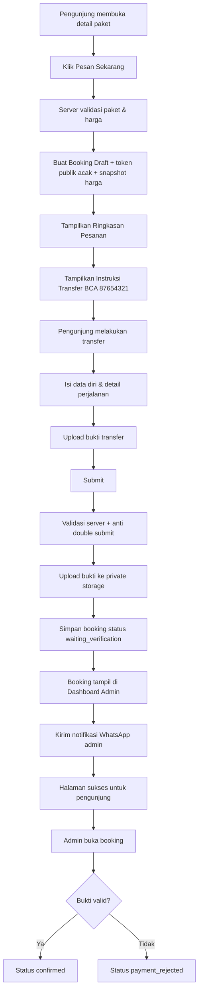

# Alur Pemesanan & Pembayaran Transfer

Dokumen ini adalah sumber utama untuk flow booking.

## Ringkasan

Pengunjung tidak perlu login. Pemesanan dilakukan dengan transfer manual BCA, pengisian form, dan upload bukti transfer. Admin melakukan verifikasi manual.

## Flow End-to-End



## Tahap 1 — Memilih Paket

CTA: `Pesan Sekarang`

Saat CTA ditekan:

1. server mengambil paket aktif;
2. server memvalidasi harga/promo;
3. server membuat booking draft;
4. server membuat token random yang tidak mudah ditebak;
5. server menyimpan snapshot harga.

Browser hanya menerima data yang diperlukan untuk melanjutkan.

## Tahap 2 — Ringkasan & Instruksi Transfer

### Copy

**Judul:** `Satu Langkah Lagi untuk Mengamankan Perjalananmu.`

**Deskripsi:** `Periksa kembali detail pesanan, lalu transfer sesuai total di bawah ini. Setelah itu, kirim data diri dan bukti transfer agar admin dapat segera memverifikasi pemesananmu.`

### Ringkasan

- Nama paket
- Destination
- Tanggal keberangkatan bila ada
- Jumlah traveler
- Harga per traveler/unit
- Diskon
- **Total transfer**
- Kode booking sementara

### Rekening tujuan

```text
Bank: BCA
No. Rekening: 87654321
Atas Nama: [nilai konfigurasi admin — wajib diisi sebelum production]
Nominal: Rp [total snapshot server]
```

Copy penting:

`Transfer tepat sesuai total yang tertera agar proses verifikasi lebih mudah.`

`Simpan bukti transfer. Kamu akan membutuhkannya pada langkah berikutnya.`

## Tahap 3 — Form Data Diri

**Judul:** `Sudah Transfer? Kirim Detail Pemesananmu.`

**Deskripsi:** `Isi data dengan benar dan unggah bukti transfer. Tim admin akan memeriksa pembayaran dan mengonfirmasi pemesananmu.`

Form detail ada di `08-booking-form-data-contract.md`.

CTA submit: `Kirim Bukti & Pemesanan`

## Tahap 4 — Submit Server

Urutan atomik/logis yang disarankan:

1. validasi token draft;
2. pastikan draft belum expired/submitted;
3. validasi semua field;
4. hitung/cek ulang snapshot booking, bukan total dari client;
5. validasi file;
6. upload file private;
7. simpan path file + data booking;
8. ubah status menjadi `waiting_verification`;
9. tulis event/audit booking;
10. commit/sukses;
11. setelah data booking aman, kirim notifikasi WhatsApp.

Jika database gagal setelah upload, file yang sudah terunggah harus dihapus agar tidak menjadi orphan file.

## Tahap 5 — Halaman Sukses

### Copy

**H1:** `Pemesananmu Sudah Kami Terima 🎉`

`Bukti transfer dan data perjalananmu sudah masuk. Admin akan memeriksa pembayaran sebelum pemesanan dikonfirmasi.`

Tampilkan:

- booking code;
- package name;
- total transfer;
- status `Menunggu Verifikasi`;
- pesan `Jangan lakukan transfer kedua untuk kode booking yang sama.`

Jangan tampilkan URL bukti transfer.

## Status Booking

| Status | Arti |
|---|---|
| `draft` | booking baru dimulai, belum submit |
| `waiting_verification` | data + bukti transfer sudah diterima |
| `confirmed` | admin sudah menyatakan pembayaran valid |
| `payment_rejected` | bukti/nominal bermasalah |
| `cancelled` | dibatalkan |
| `completed` | perjalanan/pesanan selesai |
| `expired` | draft tidak diselesaikan dalam batas waktu |

## Aturan Kritis

- status `confirmed` hanya dapat diberikan admin;
- submit form tidak sama dengan pembayaran terverifikasi;
- total tidak dapat diubah lewat hidden input;
- proof upload tidak boleh public;
- notifikasi WhatsApp tidak menjadi syarat booking dianggap tersimpan;
- token booking publik tidak boleh berupa incremental database ID.
